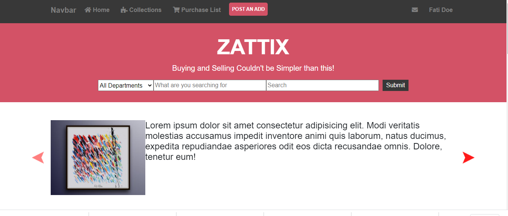

# Project 3: Using Bootstrap milestone 1

> This project is the Captstone for the HTML and CSS  curricullum. It is an ecommerce site that enable the user to buy new and or used items.

The navigation, main content and the footer were achieved using HTML, CSS and Bootstrap 

## Built With

- HTML
- CSS
- BOOTSTRAP

## Live Demo

[Live Demo Link](https://rashad-muntar.github.io/Capstone1-Ecommerce/)

## Author

👤 **Rashad Muntar**

- GitHub: [@Rashad-Muntar](https://github.com/Rashad-Muntar)
- Twitter: [@RashadToure](https://twitter.com/twitterhandle)

## 🤝 Contributing

Contributions, issues, and feature requests are welcome!

Feel free to check the [issues page](issues/).

## Show your support

Give a ⭐️ if you like this project!

## Acknowledgments

- [Micoverse team](https://microverse.pathwright.com/library/new-technical-curriculum/177956/path/step/104246979/)

## 📝 License
## Credit to Esty for the images used
This project is [MIT](lic.url) licensed.
